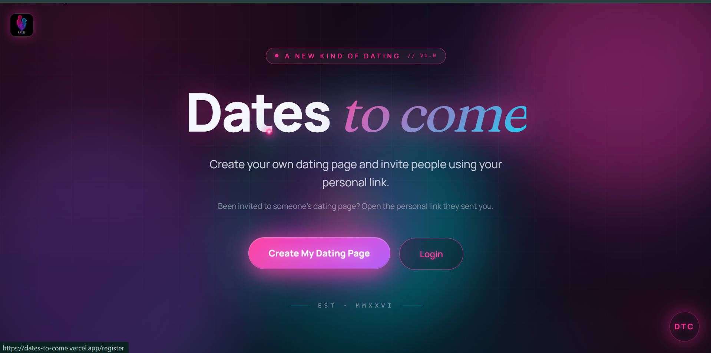
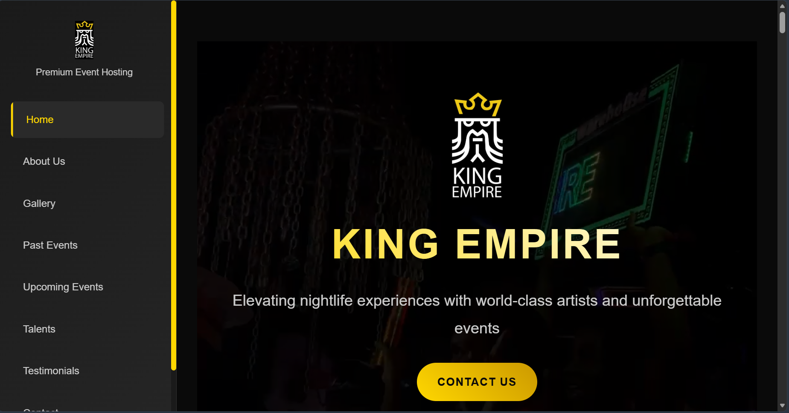
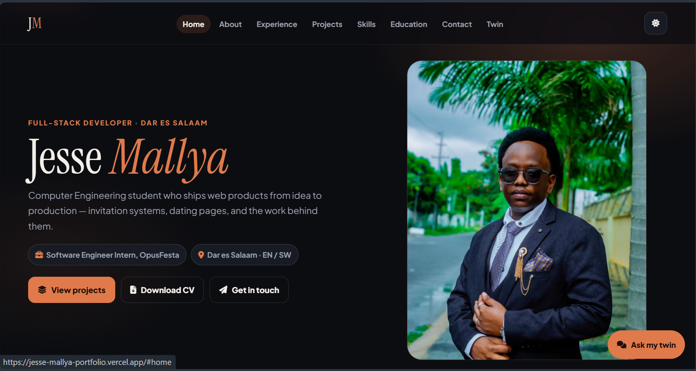
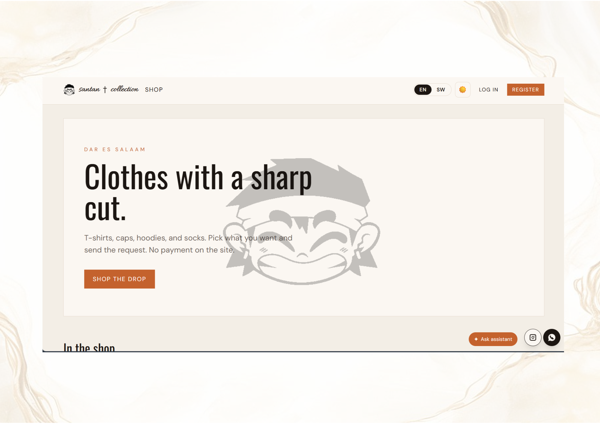

<div align="center">



<h1>Jesse Firmin Mallya</h1>

<h3>I ship web products people actually use.</h3>

<a href="https://git.io/typing-svg"></a>

<p>
  Computer Engineering student at DIT · Dar es Salaam<br />
  Software Engineer Intern at OpusFesta
</p>

<p>
  <a href="https://jesse-mallya-portfolio.vercel.app/"></a>
  <a href="https://www.linkedin.com/in/jesse-mallya-9a265536a/"></a>
  <a href="mailto:jessemallya@gmail.com"></a>
</p>

</div>

I build the product, not just the page: invitation flows, ticket payments, campus dashboards, and an assistant that answers from live data. Most of that work is Next.js and TypeScript, with PHP and MySQL when the job needs it.

## Work I have shipped

<table>
  <tr>
    <td width="50%" valign="top">
      
      <h3>Dates to Come</h3>
      <p>A host creates a dating page and invites people with a private link. Waitlists, messaging, payments, an admin dashboard, and an AI assistant on live data.</p>
      <p><code>Next.js</code> <code>TypeScript</code> <code>Supabase</code></p>
      <a href="https://dates-to-come.vercel.app/">Live site ↗</a>
    </td>
    <td width="50%" valign="top">
      
      <h3>King Empire</h3>
      <p>Event site for a Dar es Salaam nightlife brand. Past and upcoming events, gallery, and ticket links so guests can book online.</p>
      <p><code>HTML</code> <code>CSS</code> <code>JavaScript</code></p>
      <a href="https://king-empire.vercel.app/">Live site ↗</a>
    </td>
  </tr>
  <tr>
    <td width="50%" valign="top">
      <h3>Online Task Management</h3>
      <p>Campus system for assigning, tracking, and submitting work. Separate dashboards for admin, teachers, and students.</p>
      <p><code>PHP</code> <code>MySQL</code></p>
      <a href="https://github.com/Firminjr26/ONLINE-TASK-MANAGMENT-SYSTEM">Repository ↗</a>
    </td>
    <td width="50%" valign="top">
      
      <h3>Portfolio</h3>
      <p>Personal site for the work above, plus a digital twin that answers questions about the projects and roles.</p>
      <p><code>HTML</code> <code>CSS</code> <code>JavaScript</code></p>
      <a href="https://jesse-mallya-portfolio.vercel.app/">Live site ↗</a>
    </td>
  </tr>
  <tr>
    <td width="50%" valign="top">
      
      <h3>Santan Collection</h3>
      <p>Clothing storefront for a Dar es Salaam brand. T-shirts, caps, hoodies, and socks, with English and Swahili. Customers request a piece. No payment on the site.</p>
      <p><code>Next.js</code> <code>TypeScript</code></p>
      <a href="https://santan-collection.vercel.app/">Live site ↗</a>
    </td>
    <td width="50%" valign="top"></td>
  </tr>
</table>

## Tools I take to production

**TypeScript · Next.js · React · Node.js · PHP · SQL · MySQL · Postgres · Supabase · Git · Vercel**

## How I got here

```text
2022  Built a web app at BizyTech
2024  Shipped King Empire · started Computer Engineering at DIT
2025  Chatbot and infrastructure work at MUA Insurance
2026  Intern at OpusFesta, shipping invitation workflows
 now  Full-stack products in Dar es Salaam
```

## Activity

<div align="center">




<br />


</div>

---

<div align="center">

If you have a product that needs to ship, email me.

<a href="mailto:jessemallya@gmail.com"><strong>jessemallya@gmail.com</strong></a>

</div>
